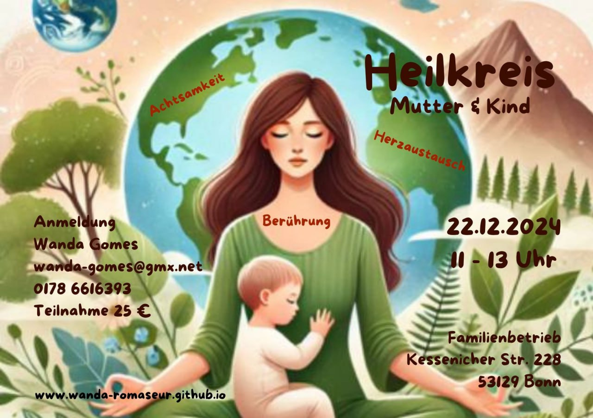

## TERMINE DEZEMBER 2024 

1.12.  HÄNDE AUFLEGEN  ( EINZELSITZUNG ) 1 1/2 std .( Zeitvorschläge sind erwünscht ) 53€

15.12.HEILKREIS  ( FOKUS AUF MODUL 2 ) 19 Uhr bis 20 Uhr.  20€

22.12. MUTTER /KIND HEILKREIS  11-13 Uhr     
 
22.12.  Wir feiern Weihnachten 🎄 

EXTRA TERMIN  !!!

 HEILKREIS FÜR HEILARBEIT . 

 SPIRITUALITÄT  , Energie Austausch  und BEWUSSTSEINERWEITERUNG  sind hier im FORDERGRUND . ENGEL ,LICHTWESEN UND HELFERLEIN  werden eingeladen um mit  uns zu wirken .

Ich freu mich auf dich ❤️❤️❤️

Spende 15 €

Uhrzeit 19 - 21 Uhr

## Heilkreis

Menschen, die sich für die Energie des Spürens öffnen wollen,
sind eingeladen, in dieser Gruppe des geistigen Heilens mitwirkend
und unterstützend für die Elemente Erde, Feuer, Luft und Wasser 
zu sein. 

Wir lernen in der Gruppe gemeinsam den ehrlichen Herzaustausch
und gehen gemeinsam in die Heilung. Ein Herzaustausch trägt dazu
bei, die Gefühle wahrzunehmen, die gerade wirklich entstehen.

Es gibt eine kleine Mediation und Körperübung, die uns helfen,
im Körper zu bleiben. Die Grundverbindung vor dem Wirken bedeutet,
dass wir mit unserem Körper, Geist und Seele uns BEWUSST machen,
uns einstimmen, für das, was gerade ist. Es geht darum, 
sich auf das Spüren einzustellen.

Die geistige Ebene hilft dabei, mit den Elementare und Elemente
wieder in Kontakt zu kommen. Damit ist auch das kleine Volk,
Lichwesen aller Art, Engel, Feen, Elfen und noch einige mehr
gemeint.

Die Essenz von Licht und Liebe, die Christus-Energie und die
Geist-Helfer sind große Werkzeuge für das Unterstützen unserer
Arbeit.

Wir gehen auf eine bewusste geistige Reise, die für die neue
Zeit ausgerichtet ist. Sich leer machen unterstützt das
SPÜREN.

**Was ist mitzubringen:** Kuscheldecke, warme Socken,
Istrumente (wenn du möchtest), deine Stimme / TON,
deine heilenden Hände und dein offenes Herz.

## Geistiges intuitives Heilen Module 1, 2 und 3

Verantwortung für unsere Gedanken und unseren Körper zu übernehmen ist Grundstein für dieses Wirken.

### Modul 1

Wir stellen den Kontakt zu unseren Elementen, Körper und Geist her.
Herzaustausch und Erd-Mediation hilft dir dabei deinen Körper zu spüren.
Die Selbstheilungskräfte werden aktiviert und die Heilung am Äußeren 
und im Inneren entsteht.

### Modul 2

Die Geführte visuelle Reise/Mediation hilft dir, deiner Wahrnehmungsfähigkeit zu
vertrauen und zu vertiefen. Körper und Geist finden Einklang mit deiner Seele.
Du kommst zur Ruhe.

### Modul 3

Modul-3 fließt mit Modul 1 und 2 ineinander. Die Arbeit mit dem leeren Raum erzeugt
eine starke Glaubenskraft, die uns lehrt unsere Intuition zu fühlen und nach ihr
effektiv zu handlen.

Alle Sinne sind aktiviert. Der 6. Sinn, das Spüren, steht jetzt im Vordergrund.
Es entsteht eine Verbindung zur Anders-Welt und dem Hier und Jetzt.
In diesem Energiebewusstsein kann Heilung entstehen.

Erkenntnisse und Antworten aller Wahrheiten und Weisheiten sind fühlbar.
Eine ganz neue Verbindung zwischen Mensch, Tier und der geistigen Welt
ist entstanden.

Alle 3 Module können auch unabhängig voneinander besucht werden.

## Über mich...

Mein Name ist Wanda Romaseur. Meine Sensibilität zur geistigen Welt
dient Menschen in eine Form von Herzebene befindlich, tröstlich,
ehrlich und offen "Sein". 
Gemeinsam finden wir heraus, welche Gefühle, Emotionen und Ängste
dich blockieren. Ich stelle mich als Medium zur Verfügung.
Belastendes kann gelöst und transformiert werden.
Ebenfalls kann Aufstellungsarbeit unterstützend sein für die Themen,
die dich beschäftigen. Kontakt mit verstorbenen Seelen ist hilfreich,
um unausgesprochenes zu verarbeiten.
Durch Traumata sind Seelenanteile verloren gegangen, auch die sind
durch visuelle Reisen zurückzuholen.

Ich freue mich auf den Kontakt mit dir.
Deine Wanda Romaseur
E-Mail: <a href="mailto:wanda-gomes@gmx.net">wanda-gomes@gmx.net</a>  
Tel.: <a href="tel:+491786616393">0178 / 661 63 93</a>
